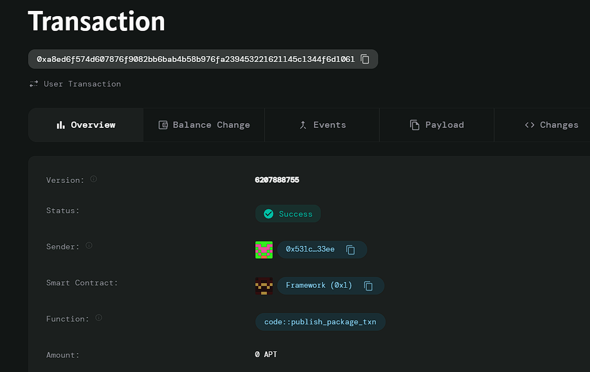

# Decentralized Lottery

# Deployed ID: 0xa8ed6f574d607876f9082bb6bab4b58b976fa239453221621145c1344f6d1061

## Project Description
A transparent and fair lottery system where users can purchase tickets through a smart contract. The contract randomly selects winners and automatically distributes prizes, ensuring that the process is tamper-proof and verifiable. This model can attract participants who value transparency and fairness in gaming.

## Project Vision
To create an engaging lottery experience that leverages blockchain technology for transparency and fairness, allowing users to participate in a lottery without the risk of fraud or manipulation.

## Key Features
- **Transparent Process**: The lottery operates on a public smart contract, ensuring all transactions are verifiable.
- **Fairness**: Random winner selection and automatic prize distribution eliminate bias.
- **User-Friendly**: Simple ticket purchasing mechanism for easy participation.
- **Secure Transactions**: All transactions are executed securely using Aptos Coin.
